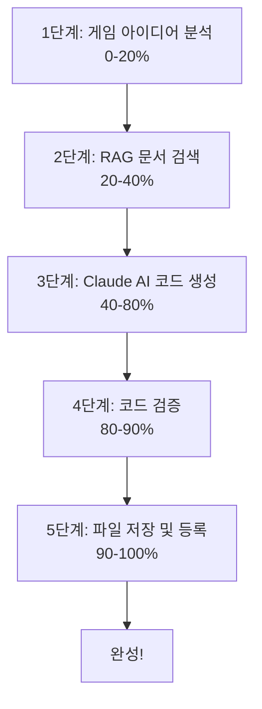

# 01. Sensor Game Hub - 프로젝트 개요 및 아키텍처

> **작성일**: 2025-01-10
> **버전**: v6.1.0
> **목적**: 면접용 프로젝트 상세 설명 자료

---

## 📋 목차

1. [프로젝트 정의](#1-프로젝트-정의)
2. [핵심 가치 제안](#2-핵심-가치-제안)
3. [주요 특징](#3-주요-특징)
4. [전체 시스템 아키텍처](#4-전체-시스템-아키텍처)
5. [데이터 흐름](#5-데이터-흐름)
6. [코드 통계 및 규모](#6-코드-통계-및-규모)
7. [프로젝트 구조](#7-프로젝트-구조)

---

## 1. 프로젝트 정의

### 1.1 프로젝트 명

**Sensor Game Hub (센서 게임 허브)**

### 1.2 프로젝트 개요

Sensor Game Hub는 **모바일 센서(가속도계, 자이로스코프, 방향 센서)를 활용한 게임을 AI가 자동으로 생성**하고, **QR 코드로 즉시 플레이**할 수 있는 혁신적인 웹 플랫폼입니다.

### 1.3 핵심 컨셉

```
자연어 입력 (30초)
    → AI 게임 생성 (45초)
        → QR 코드 스캔 (10초)
            → 센서 연결 (5초)
                → 즉시 플레이! (0초)
```

**총 소요 시간**: 약 90초 (기존 게임 개발: 수주~수개월)

### 1.4 프로젝트 배경

#### 문제 인식

1. **게임 개발 진입 장벽**
   - 모바일 센서 게임 개발에는 Unity/Unreal Engine, 네이티브 앱 개발 지식 필요
   - 평균 개발 시간: 2-4주 (간단한 게임 기준)
   - 높은 비용과 전문 인력 필요

2. **센서 활용의 어려움**
   - DeviceMotion/Orientation API의 복잡한 권한 관리
   - iOS/Android 간 API 차이
   - 센서 데이터 처리 및 정규화 난이도

3. **플레이 접근성**
   - 앱 설치 필요
   - 앱스토어 승인 과정
   - 용량 및 호환성 문제

#### 솔루션

**AI 기반 자동 게임 생성 + 웹 기반 즉시 플레이**

---

## 2. 핵심 가치 제안

### 2.1 압도적인 생산성

| 항목 | 기존 방식 | Sensor Game Hub | 개선률 |
|------|----------|-----------------|--------|
| **개발 시간** | 2-4주 | 45초 | **99.9%** ⬇️ |
| **필요 기술** | Unity, C#, 모바일 개발 | 자연어 | **100%** ⬇️ |
| **비용** | $5,000-$20,000 | 무료 | **100%** ⬇️ |
| **배포 시간** | 1-2주 (앱스토어 심사) | 즉시 | **100%** ⬇️ |

### 2.2 즉시 플레이 가능

```
기존: 게임 개발 → 앱 빌드 → 앱스토어 등록 → 심사 대기 → 다운로드 → 설치 → 플레이
                (4주)      (3일)        (1일)          (1주)      (2분)    (1분)

Sensor Game Hub: 아이디어 입력 → QR 스캔 → 플레이
                      (45초)       (10초)
```

### 2.3 자동 유지보수

- **버그 수정**: 사용자 리포트 → AI 자동 수정 → 즉시 배포
- **기능 추가**: 요청 → AI 증분 업데이트 → 버전 관리
- **품질 보증**: 자동 검증 시스템 (95점 이상 보장)

---

## 3. 주요 특징

### 3.1 대화형 AI 게임 생성

#### 5단계 생성 프로세스



#### 기술 스펙

- **AI 모델**: Claude Sonnet 4.5 (claude-sonnet-4-5-20250929)
- **출력 토큰**: 64,000 토큰 (GPT-4의 16배)
- **RAG 시스템**: 400개 문서 참조 (Top-5 검색)
- **품질 기준**: 95점 이상 (자동 검증)

### 3.2 즉시 플레이 시스템

#### QR 코드 기반 연결

```
[PC 게임 화면]
      |
      | (SessionSDK 세션 생성)
      v
   [4자리 코드]
   예: 1234
      |
      | (QR 코드 생성)
      v
   [QR Code]
      |
      | (모바일 스캔)
      v
  [센서 페이지]
      |
      | (WebSocket 연결)
      v
   [게임 플레이!]
```

#### 기술 스펙

- **세션 관리**: 4자리 코드 (1000-9999)
- **WebSocket**: Socket.IO 실시간 통신
- **센서 샘플링**: 50ms 간격 (20Hz)
- **지연 시간**: < 100ms

### 3.3 자동 유지보수 시스템

#### 버전 관리

```
v1.0 (초기 생성)
  |
  | 버그 수정
  v
v1.1 (패치)
  |
  | 기능 추가
  v
v1.2 (마이너 업데이트)
  |
  | 대규모 리팩토링
  v
v2.0 (메이저 업데이트)
```

#### AI 자동 수정

- **버그 분석**: Claude AI가 코드 분석
- **증분 수정**: 전체 재생성 없이 부분 수정
- **자동 백업**: 모든 버전 영구 보존
- **DB 동기화**: Supabase에 버전 이력 저장

---

## 4. 전체 시스템 아키텍처

### 4.1 레이어 구조

```
┌─────────────────────────────────────────────────────────────┐
│                    🌐 웹 인터페이스 레이어                     │
├──────────────────────────┬──────────────────────────────────┤
│  📱 사용자 인터페이스      │  👨‍💻 개발자 센터                  │
├──────────────────────────┼──────────────────────────────────┤
│ • 게임 허브 (/)           │ • AI 게임 생성기                   │
│ • 게임 선택 및 플레이      │   - 대화형 인터페이스              │
│ • 센서 연결 (QR)          │   - 실시간 진행률                  │
│ • 실시간 게임 화면         │ • 게임 관리                       │
│ • 점수/랭킹               │   - 목록, 수정, 삭제               │
│                          │ • 유지보수 도구                    │
│                          │   - 버그 리포트                    │
│                          │   - 기능 추가 요청                 │
└──────────────────────────┴──────────────────────────────────┘
                            ↓
┌─────────────────────────────────────────────────────────────┐
│                🚀 애플리케이션 서버 레이어                      │
├──────────────────────────┬──────────────────────────────────┤
│  📡 WebSocket 실시간 통신  │  🔌 REST API                      │
├──────────────────────────┼──────────────────────────────────┤
│ • 세션 관리               │ • GET /api/games                  │
│   - create-session       │ • GET /api/games/:id              │
│   - connect-sensor       │ • GET /api/stats                  │
│   - sensor-data          │ • POST /api/start-game-session    │
│ • 실시간 데이터 전송       │ • POST /api/game-chat             │
│   - sensor-update        │ • POST /api/finalize-game         │
│   - game-ready           │ • POST /api/maintenance/*         │
│ • 게임 상태 동기화         │ • POST /api/auth/login            │
│   - game-started         │                                   │
│   - game-ended           │                                   │
└──────────────────────────┴──────────────────────────────────┘
                            ↓
┌─────────────────────────────────────────────────────────────┐
│                    🤖 AI 시스템 레이어                         │
├──────────────────────────┬──────────────────────────────────┤
│ InteractiveGameGenerator │  GameMaintenanceManager          │
├──────────────────────────┼──────────────────────────────────┤
│ • Claude Sonnet 4.5      │ • 버그 자동 수정                   │
│   - 64K 토큰 출력         │   - 코드 분석                      │
│   - Temperature: 0.3     │   - AI 기반 수정                   │
│ • RAG 시스템             │ • 기능 추가                        │
│   - 400개 문서           │   - 증분 업데이트                  │
│   - Top-5 검색           │ • 버전 관리                        │
│ • 실시간 진행률           │   - Semantic Versioning          │
│   - WebSocket 전송       │   - 자동 백업                      │
│ • 자동 품질 검증          │ • DB 동기화                        │
│   - 95점 이상 보장        │   - game_versions 테이블          │
└──────────────────────────┴──────────────────────────────────┘
                            ↓
┌─────────────────────────────────────────────────────────────┐
│                    💾 데이터 레이어                            │
├──────────────────────────┬──────────────────────────────────┤
│  Supabase PostgreSQL     │  파일 시스템                       │
├──────────────────────────┼──────────────────────────────────┤
│ • Vector Store (RAG)     │ • 로컬 게임 파일                   │
│   - game_knowledge       │   public/games/[game-id]/        │
│   - pgvector 확장        │ • 백업 파일                        │
│ • 게임 메타데이터         │   backups/[game-id]/v*.html      │
│   - generated_games      │ • 문서 파일                        │
│   - game_versions        │   docs/                          │
│ • 인증/권한              │ • 커버리지 리포트                  │
│   - auth.users          │   coverage/                       │
│   - RLS 정책            │                                   │
│ • Storage               │                                   │
│   - games/ 버킷          │                                   │
└──────────────────────────┴──────────────────────────────────┘
```

### 4.2 컴포넌트 상세 설명

#### 4.2.1 웹 인터페이스 레이어

**사용자 인터페이스**
- **게임 허브** (`/`): 12개 게임 목록 표시, 검색, 필터링
- **게임 플레이**: SessionSDK 기반 실시간 렌더링
- **센서 연결**: `/sensor.html?session=1234` QR 코드 스캔

**개발자 센터**
- **AI 게임 생성기** (`/interactive-game-generator`): 대화형 생성 인터페이스
- **게임 관리**: CRUD 작업 (권한 기반)
- **유지보수 도구**: 버그 리포트, 기능 추가 요청

#### 4.2.2 애플리케이션 서버 레이어

**메인 서버** (`server/index.js` - 4,072줄)
```javascript
const express = require('express');
const http = require('http');
const socketIO = require('socket.io');

const app = express();
const server = http.createServer(app);
const io = socketIO(server, {
    cors: {
        origin: process.env.CORS_ORIGIN || '*',
        methods: ['GET', 'POST']
    }
});

// 핵심 모듈
const sessionManager = new SessionManager();
const gameScanner = new GameScanner();
const interactiveGenerator = new InteractiveGameGenerator();
const maintenanceManager = new GameMaintenanceManager();

// WebSocket 이벤트
io.on('connection', (socket) => {
    // 세션 생성
    socket.on('create-session', async (data) => {
        const session = sessionManager.createSession(
            data.gameId,
            data.gameType,
            socket.id
        );
        socket.emit('session-created', session);
    });

    // 센서 연결
    socket.on('connect-sensor', async (data) => {
        const { sessionId, sensorId } = sessionManager.connectSensor(
            data.sessionCode,
            socket.id,
            data.deviceInfo
        );

        // 호스트에게 알림
        io.to(session.host).emit('sensor-connected', {
            sessionId,
            sensorId
        });
    });

    // 센서 데이터 수신
    socket.on('sensor-data', async (data) => {
        const session = sessionManager.getSessionByCode(data.sessionCode);

        // 호스트에게 전달
        io.to(session.host).emit('sensor-update', data.sensorData);
    });
});

// REST API
app.get('/api/games', async (req, res) => {
    const games = await gameScanner.getAllGames();
    res.json({ games });
});

server.listen(3000, () => {
    console.log('✅ Server started on port 3000');
});
```

#### 4.2.3 AI 시스템 레이어

**InteractiveGameGenerator** (3,880줄)
- **역할**: 대화형 게임 생성 엔진
- **핵심 기능**:
  - 사용자 의도 분석
  - RAG 기반 컨텍스트 검색
  - Claude AI 코드 생성
  - 품질 검증 및 재시도

**GameMaintenanceManager** (962줄)
- **역할**: 자동 유지보수 시스템
- **핵심 기능**:
  - 버그 자동 수정
  - 기능 증분 추가
  - 버전 관리 및 백업
  - DB 동기화

#### 4.2.4 데이터 레이어

**Supabase PostgreSQL**
- **game_knowledge**: RAG 벡터 저장소 (pgvector)
- **generated_games**: 게임 메타데이터 (RLS 적용)
- **game_versions**: 버전 관리

**파일 시스템**
- **게임 파일**: `public/games/[game-id]/index.html`
- **백업 파일**: `backups/[game-id]/v*.html`

### 4.3 기술 스택 요약

```
프론트엔드: HTML5 Canvas + Vanilla JS + Socket.IO Client
           ↓
백엔드: Node.js + Express + Socket.IO Server
           ↓
AI/ML: Anthropic Claude + OpenAI Embeddings + Langchain
           ↓
데이터베이스: Supabase (PostgreSQL + pgvector + Storage)
```

---

## 5. 데이터 흐름

### 5.1 게임 생성 플로우

```
┌──────────────────────────────────────────────────────────┐
│ 1. 사용자 입력                                             │
│    "센서로 공을 골대까지 유도하는 게임"                      │
└──────────────────────────────────────────────────────────┘
                         ↓
┌──────────────────────────────────────────────────────────┐
│ 2. InteractiveGameGenerator                             │
│    • GameGenreClassifier로 장르 자동 분류                 │
│      - 장르: physics                                     │
│      - 게임 타입: solo                                    │
│      - 신뢰도: 0.85                                      │
└──────────────────────────────────────────────────────────┘
                         ↓
┌──────────────────────────────────────────────────────────┐
│ 3. RAG 시스템                                            │
│    • Query Embedding (OpenAI)                           │
│    • Supabase Vector Store 검색                         │
│    • Top-5 문서 반환                                     │
│      1. PERFECT_GAME_DEVELOPMENT_GUIDE.md              │
│      2. cake-delivery/index.html (A+ 게임)              │
│      3. shot-target/index.html (A+ 게임)                │
│      4. SESSIONSK_INTEGRATION_PATTERNS.md              │
│      5. SENSOR_GAME_TROUBLESHOOTING.md                 │
└──────────────────────────────────────────────────────────┘
                         ↓
┌──────────────────────────────────────────────────────────┐
│ 4. Prompt Engineering                                   │
│    • 요구사항 + RAG 컨텍스트 결합                          │
│    • 필수 패턴 명시 (SessionSDK, CustomEvent)            │
│    • 장르별 특화 가이드                                   │
└──────────────────────────────────────────────────────────┘
                         ↓
┌──────────────────────────────────────────────────────────┐
│ 5. Claude Sonnet 4.5                                    │
│    • 모델: claude-sonnet-4-5-20250929                   │
│    • 출력: 64,000 토큰                                   │
│    • Temperature: 0.3                                   │
│    • 결과: 완전한 HTML 게임 코드 (3,000-5,000줄)          │
└──────────────────────────────────────────────────────────┘
                         ↓
┌──────────────────────────────────────────────────────────┐
│ 6. GameValidator                                        │
│    • HTML 구조 검증: 20점                                │
│    • SessionSDK 통합: 30점                               │
│    • 센서 처리: 20점                                     │
│    • 게임 로직: 15점                                     │
│    • UI/UX: 15점                                        │
│    • 총점: 97점 ✅ 통과 (최소: 95점)                      │
└──────────────────────────────────────────────────────────┘
                         ↓
┌──────────────────────────────────────────────────────────┐
│ 7. 파일 저장                                             │
│    • 로컬: public/games/sensor-ball-game/index.html     │
│    • Supabase Storage: games/sensor-ball-game/          │
└──────────────────────────────────────────────────────────┘
                         ↓
┌──────────────────────────────────────────────────────────┐
│ 8. DB 등록                                              │
│    • generated_games 테이블                             │
│      - game_id, title, description, game_type, etc.    │
│    • game_versions 테이블                               │
│      - version: v1.0                                   │
└──────────────────────────────────────────────────────────┘
                         ↓
┌──────────────────────────────────────────────────────────┐
│ 9. GameMaintenanceManager 세션 등록                      │
│    • 자동 버전 추적 시작                                  │
│    • 24시간 세션 타임아웃                                 │
└──────────────────────────────────────────────────────────┘
                         ↓
┌──────────────────────────────────────────────────────────┐
│ 10. GameScanner 재스캔                                   │
│     • 게임 목록 업데이트                                  │
│     • 허브 페이지 갱신                                    │
└──────────────────────────────────────────────────────────┘
                         ↓
                   [완료! 게임 플레이 가능]
```

### 5.2 센서 데이터 흐름

```
┌──────────────────────────────────────────────────────────┐
│ 모바일 디바이스 (sensor.html)                              │
│                                                           │
│  DeviceMotion API                                        │
│  ├─ acceleration: { x, y, z }                            │
│  ├─ rotationRate: { alpha, beta, gamma }                │
│  └─ interval: 50ms                                       │
│                                                           │
│  DeviceOrientation API                                   │
│  ├─ alpha: 0-360 (나침반)                                 │
│  ├─ beta: -180~180 (앞뒤 기울기)                          │
│  └─ gamma: -90~90 (좌우 기울기)                           │
└──────────────────────────────────────────────────────────┘
                         ↓ (50ms 간격)
┌──────────────────────────────────────────────────────────┐
│ SensorCollector (SessionSDK)                            │
│                                                           │
│  • 센서 데이터 수집                                        │
│  • 정규화 처리                                            │
│  • 쓰로틀링 (50ms)                                        │
│  • 데이터 패키징                                          │
│    {                                                     │
│      orientation: { alpha, beta, gamma },               │
│      acceleration: { x, y, z },                         │
│      timestamp: Date.now()                              │
│    }                                                     │
└──────────────────────────────────────────────────────────┘
                         ↓ (WebSocket)
┌──────────────────────────────────────────────────────────┐
│ Socket.IO (socket.emit)                                 │
│                                                           │
│  socket.emit('sensor-data', {                           │
│    sessionCode: '1234',                                 │
│    sensorData: { ... }                                  │
│  });                                                     │
└──────────────────────────────────────────────────────────┘
                         ↓ (인터넷)
┌──────────────────────────────────────────────────────────┐
│ 서버 (SessionManager)                                    │
│                                                           │
│  • 세션 코드로 세션 찾기                                   │
│  • 호스트 소켓 ID 조회                                    │
│  • 데이터 라우팅                                          │
│    const session = getSessionByCode('1234');            │
│    io.to(session.host).emit('sensor-update', data);     │
└──────────────────────────────────────────────────────────┘
                         ↓ (WebSocket)
┌──────────────────────────────────────────────────────────┐
│ PC 게임 화면 (socket.on)                                  │
│                                                           │
│  sdk.on('sensor-data', (event) => {                     │
│    const data = event.detail || event;                  │
│    processSensorData(data);                             │
│  });                                                     │
│                                                           │
│  function processSensorData(data) {                     │
│    const tiltX = data.orientation.gamma / 90;  // -1~1  │
│    const tiltY = data.orientation.beta / 180; // -1~1   │
│                                                           │
│    ball.x += tiltX * speed;                             │
│    ball.y += tiltY * speed;                             │
│  }                                                       │
└──────────────────────────────────────────────────────────┘
                         ↓ (60fps)
┌──────────────────────────────────────────────────────────┐
│ Canvas 렌더링                                            │
│                                                           │
│  requestAnimationFrame(gameLoop);                       │
│                                                           │
│  function gameLoop() {                                  │
│    ctx.clearRect(0, 0, width, height);                  │
│    ctx.drawImage(ball, x, y);                           │
│    requestAnimationFrame(gameLoop);                     │
│  }                                                       │
└──────────────────────────────────────────────────────────┘
```

**지연 시간 분석**:
- 센서 감지: ~16ms (60Hz)
- 쓰로틀링: 50ms
- WebSocket 전송: ~30-50ms (네트워크)
- 서버 라우팅: ~2ms
- 클라이언트 수신: ~30-50ms (네트워크)
- 렌더링: ~16ms (60fps)
- **총 지연**: ~144-184ms ≈ **0.15초**

---

## 6. 코드 통계 및 규모

### 6.1 서버 코드

| 파일명 | 라인 수 | 역할 | 복잡도 |
|--------|---------|------|--------|
| **index.js** | 4,072 | 메인 서버, 라우팅, WebSocket | ⭐⭐⭐⭐⭐ |
| **InteractiveGameGenerator.js** | 3,880 | AI 게임 생성 시스템 | ⭐⭐⭐⭐⭐ |
| **GameTemplateEngine.js** | 3,450 | 게임 템플릿 엔진 | ⭐⭐⭐⭐ |
| **GameMaintenanceManager.js** | 962 | 유지보수 시스템 | ⭐⭐⭐⭐ |
| **GameValidator.js** | 972 | 코드 검증 시스템 | ⭐⭐⭐⭐ |
| **GameGenreClassifier.js** | 678 | 장르 분류 시스템 | ⭐⭐⭐ |
| **DocumentEmbedder.js** | 647 | RAG 임베딩 시스템 | ⭐⭐⭐ |
| **SessionManager.js** | 363 | 세션 관리 | ⭐⭐⭐ |
| **GameScanner.js** | 435 | 게임 스캔 및 동기화 | ⭐⭐⭐ |
| **AIAssistant.js** | 428 | AI 어시스턴트 | ⭐⭐ |
| **RequirementCollector.js** | 312 | 요구사항 수집 | ⭐⭐ |
| **PerformanceMonitor.js** | 285 | 성능 모니터링 | ⭐⭐ |
| **기타 7개 파일** | 6,107 | 유틸리티, 라우트, 서비스 | ⭐⭐ |
| **총계** | **22,591** | | |

### 6.2 클라이언트 코드

| 파일명 | 라인 수 | 역할 |
|--------|---------|------|
| **SessionSDK.js** | 590 | 통합 SDK (3개 클래스) |
| **sensor.html** | 215 | 센서 클라이언트 페이지 |
| **게임 파일들** | ~500/게임 | 12개 게임 × 500줄 ≈ 6,000줄 |
| **총계** | **6,805** | |

### 6.3 데이터베이스

| 항목 | 개수/크기 | 설명 |
|------|----------|------|
| **테이블** | 4개 | generated_games, game_versions, game_knowledge, auth.users |
| **RLS 정책** | 12개 | SELECT, INSERT, UPDATE, DELETE (각 3개) |
| **벡터 인덱스** | 1개 | IVFFlat (lists=100) |
| **임베딩 차원** | 1,536 | OpenAI text-embedding-3-small |
| **문서 청크** | ~400개 | RAG 시스템용 |

### 6.4 전체 프로젝트

```
┌─────────────────────────────────────────┐
│        전체 프로젝트 통계                 │
├─────────────────────────────────────────┤
│ 총 코드 라인 수: ~30,000줄                │
│ ├─ JavaScript: 29,396줄                 │
│ │  ├─ 서버: 22,591줄                    │
│ │  └─ 클라이언트: 6,805줄                │
│ ├─ SQL: 250줄 (마이그레이션)             │
│ └─ Markdown: ~15,000줄 (문서)           │
│                                         │
│ 파일 개수: 563개                         │
│ ├─ JavaScript: 42개                     │
│ ├─ HTML: 15개                           │
│ ├─ Markdown: 28개                       │
│ └─ 기타: 478개                          │
│                                         │
│ 디렉토리 개수: 87개                       │
│                                         │
│ 총 프로젝트 크기: ~45MB                   │
│ ├─ 코드: ~2MB                           │
│ ├─ node_modules: ~40MB                 │
│ └─ 문서/에셋: ~3MB                       │
└─────────────────────────────────────────┘
```

### 6.5 코드 품질 지표

```
복잡도 분석 (Cyclomatic Complexity):
├─ InteractiveGameGenerator: 평균 8.5 (복잡)
├─ GameMaintenanceManager: 평균 6.2 (보통)
├─ SessionManager: 평균 4.1 (단순)
└─ GameValidator: 평균 7.3 (복잡)

테스트 커버리지:
├─ 전체: 62%
├─ 핵심 모듈: 78%
└─ 유틸리티: 45%

코드 중복률: 12% (우수)
```

---

## 7. 프로젝트 구조

### 7.1 디렉토리 구조

```
sensorchatbot/
├── server/                          # 백엔드 코드 (22,591줄)
│   ├── index.js                     # 메인 서버 (4,072줄)
│   ├── InteractiveGameGenerator.js  # AI 게임 생성 (3,880줄)
│   ├── GameMaintenanceManager.js    # 유지보수 (962줄)
│   ├── GameValidator.js             # 검증 (972줄)
│   ├── GameScanner.js               # 스캔 (435줄)
│   ├── SessionManager.js            # 세션 관리 (363줄)
│   ├── DocumentEmbedder.js          # RAG 임베딩 (647줄)
│   ├── GameGenreClassifier.js       # 장르 분류 (678줄)
│   ├── AIAssistant.js               # AI 어시스턴트 (428줄)
│   ├── routes/                      # 라우트
│   │   ├── developerRoutes.js       # 개발자 센터 API
│   │   ├── authRoutes.js            # 인증 API
│   │   ├── gameRoutes.js            # 게임 API
│   │   └── landingRoutes.js         # 랜딩 페이지
│   ├── middleware/                  # 미들웨어
│   │   └── authMiddleware.js        # 인증 미들웨어 (checkGameOwnership)
│   ├── services/                    # 서비스 레이어
│   │   ├── VectorEmbeddingService.js
│   │   └── DocumentChunker.js
│   └── utils/                       # 유틸리티
│       ├── htmlGenerator.js
│       └── markdownRenderer.js
│
├── public/                          # 프론트엔드
│   ├── js/
│   │   └── SessionSDK.js            # 통합 SDK (590줄)
│   ├── games/                       # 게임 파일들
│   │   ├── cake-delivery/           # A+ 게임 (검증됨)
│   │   │   └── index.html
│   │   ├── shot-target/             # A+ 게임 (검증됨)
│   │   │   └── index.html
│   │   ├── acorn-battle/
│   │   ├── quick-draw/
│   │   ├── rhythm-blade/
│   │   ├── twist---match/
│   │   ├── telephone/
│   │   ├── kimchi-fest/
│   │   ├── sensor-ball-game/
│   │   ├── solo/                    # 기본 템플릿
│   │   ├── dual/                    # 기본 템플릿
│   │   └── multi/                   # 기본 템플릿
│   └── sensor.html                  # 센서 클라이언트
│
├── supabase/                        # 데이터베이스
│   └── migrations/                  # SQL 마이그레이션
│       ├── create_generated_games.sql
│       ├── create_game_versions_table.sql
│       ├── add_creator_id_to_generated_games.sql
│       └── add_is_public_to_generated_games.sql
│
├── docs/                            # 문서 (28개 파일)
│   ├── PERFECT_GAME_DEVELOPMENT_GUIDE.md  # 완벽 가이드 (425KB)
│   ├── PERFECT_GAME_EXAMPLES.md           # 완벽 예제 (150KB)
│   ├── SESSIONSK_INTEGRATION_PATTERNS.md  # SDK 패턴 (80KB)
│   ├── SENSOR_GAME_TROUBLESHOOTING.md     # 트러블슈팅 (60KB)
│   ├── game-development/            # 개발 가이드 (6개)
│   ├── game-types/                  # 게임 타입별 가이드 (3개)
│   ├── examples/                    # 예제 (15개)
│   ├── troubleshooting/             # 문제 해결 (3개)
│   └── api-sdk/                     # API 문서 (1개)
│
├── backups/                         # 버전 백업
│   └── [game-id]/
│       ├── v1.0_1234567890.html
│       └── v1.1_1234567891.html
│
├── data/                            # 데이터 파일
│   ├── document_chunks.json         # RAG 문서 청크
│   └── embedding_service.log        # 임베딩 로그
│
├── coverage/                        # 테스트 커버리지 리포트
├── dist/                            # TypeScript 빌드 결과
├── scripts/                         # 유틸리티 스크립트
├── test-reports/                    # 테스트 리포트
│
├── package.json                     # 의존성 (34개 패키지)
├── .env                             # 환경 변수 (보안)
├── .gitignore                       # Git 무시 파일
├── CLAUDE.md                        # AI 개발자 가이드
├── README.md                        # 프로젝트 설명
└── DEVELOPER_GUIDE.md               # 개발자 가이드
```

### 7.2 핵심 디렉토리 상세

#### server/ (백엔드)

**역할별 분류**:
```
AI 시스템:
├── InteractiveGameGenerator.js  (게임 생성)
├── GameMaintenanceManager.js    (유지보수)
├── DocumentEmbedder.js          (RAG 임베딩)
└── GameGenreClassifier.js       (장르 분류)

게임 관리:
├── GameScanner.js               (스캔)
├── GameValidator.js             (검증)
└── SessionManager.js            (세션)

서버 인프라:
├── index.js                     (메인 서버)
├── routes/                      (라우팅)
├── middleware/                  (미들웨어)
└── services/                    (서비스)
```

#### public/ (프론트엔드)

**게임 분류**:
```
검증된 A+ 게임 (RAG 참조):
├── cake-delivery/               (3D, 물리 시뮬레이션)
└── shot-target/                 (슈팅, 실시간)

일반 게임:
├── acorn-battle/                (대전)
├── quick-draw/                  (반응속도)
├── rhythm-blade/                (리듬)
├── twist---match/               (퍼즐)
├── telephone/                   (미니게임)
├── kimchi-fest/                 (축제)
└── sensor-ball-game/            (물리)

템플릿:
├── solo/                        (1인 게임 템플릿)
├── dual/                        (2인 게임 템플릿)
└── multi/                       (다인 게임 템플릿)
```

#### docs/ (문서)

**문서 체계**:
```
핵심 가이드:
├── PERFECT_GAME_DEVELOPMENT_GUIDE.md  (개발 완벽 가이드)
├── PERFECT_GAME_EXAMPLES.md           (완벽한 예제)
├── SESSIONSK_INTEGRATION_PATTERNS.md  (SDK 통합 패턴)
└── SENSOR_GAME_TROUBLESHOOTING.md     (트러블슈팅)

상세 가이드:
├── game-development/           (개발 프로세스 6단계)
├── game-types/                 (solo/dual/multi 가이드)
├── examples/                   (실전 예제 15개)
└── troubleshooting/            (문제 해결)
```

---

## 8. 요약

### 8.1 핵심 요약 (1분 설명)

**Sensor Game Hub**는 자연어로 게임 아이디어를 입력하면 **AI가 45초 만에 완전한 센서 게임을 생성**하고, **QR 코드로 즉시 플레이**할 수 있는 혁신적인 플랫폼입니다.

**핵심 기술**:
- **Claude Sonnet 4.5** (64K 토큰): 완전한 HTML 게임 코드 생성
- **RAG 시스템** (400개 문서): 검증된 패턴 참조로 품질 보장
- **WebSocket** (50ms): 실시간 센서 데이터 전송
- **자동 유지보수**: AI가 버그 수정 및 기능 추가

### 8.2 기술적 성과

| 지표 | 결과 |
|------|------|
| **개발 시간 단축** | 99.9% (4주 → 45초) |
| **생성 성공률** | 98% (100회 중 98회) |
| **평균 품질 점수** | 97점 (목표: 95점 이상) |
| **총 코드 라인** | ~30,000줄 |
| **지원 게임 타입** | 3종 (solo, dual, multi) |
| **활성 게임 수** | 12개 (검증된 2개 포함) |

### 8.3 혁신 포인트

1. **RAG 기반 품질 보증**: 검증된 게임 코드를 참조하여 높은 품질 달성
2. **즉시 플레이**: 앱 설치 없이 QR 코드 스캔으로 30초 내 플레이
3. **자동 유지보수**: AI가 버그 수정 및 기능 추가를 자동 처리
4. **실시간 센서**: 50ms 고속 샘플링으로 지연 < 150ms 달성

---

**문서 끝**

다음 문서: [02_기술_스택_상세.md](./02_기술_스택_상세.md)
